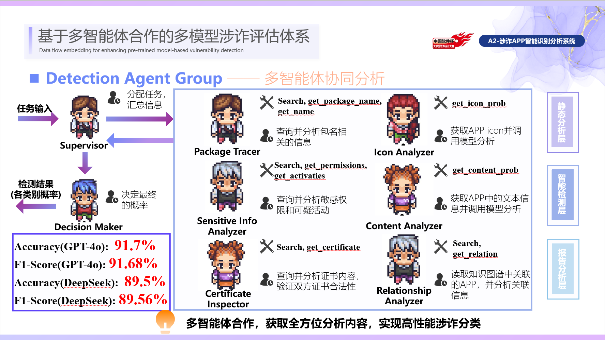
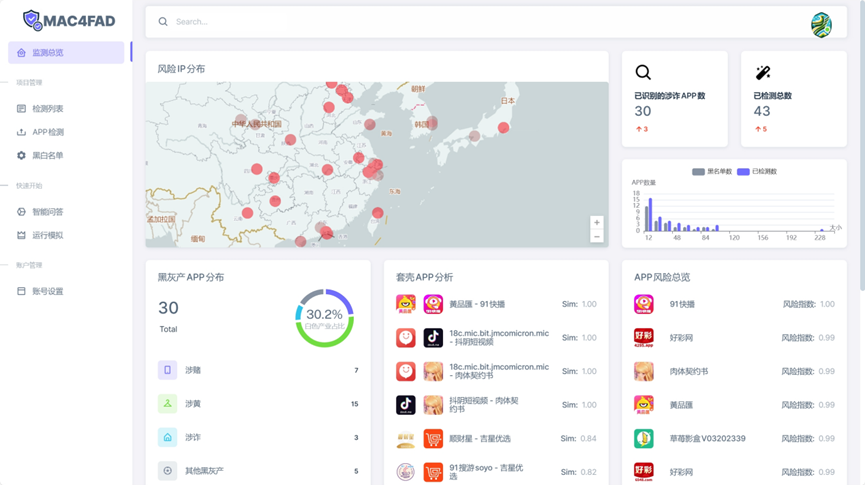
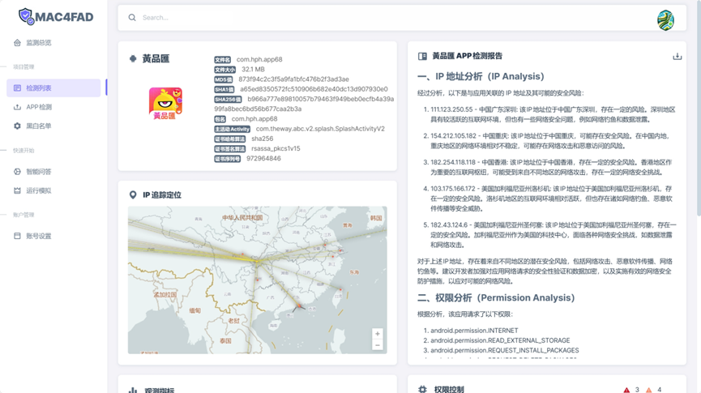
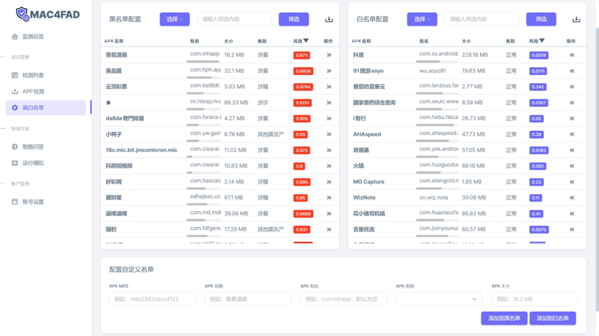

# Muti-Agents Collaboration for Fraud APP Detection
2024中国软件杯大学生软件设计大赛全国一等奖，作品展示
___

## 项目简介
电信网络诈骗严重危害人民财产安全，事关广大群众的切身利益，事关社会经济稳定发展，事关国家长治久安。
自2023至2024年1月，我国公安部门就已破获电信网络诈骗43.7万起，拦截涉案金额超过3288亿元，利用App进行诈骗约占整体案发量的六成。
因此，亟需一套合理的涉诈APP智能识别系统帮助公安及相关部门快速侦破案件，减少人民财产丢失，全力守护人民群众的“钱袋子”。
___

## 技术路线

___

## 部分页面展示

