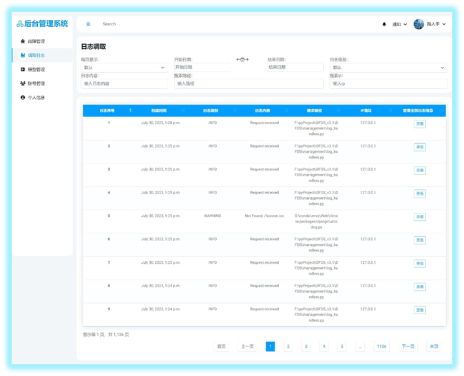
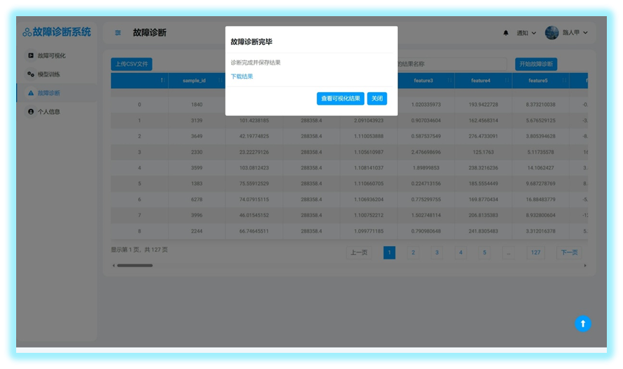

# 分布式系统故障诊断系统
2023中国软件杯大学生软件设计大赛全国三等奖，作品展示

## 项目简介
在当今社会，医疗保险扮演着至关重要的角色，不仅是管理医疗资源、提升人民生活质量的关键，更是维护社会稳定与和谐的基石。中国，作为人口超过13亿的国家，拥有庞大的国家医保体系，涵盖了广大民众。
然而，随着体系的庞大和复杂，医疗保险欺诈问题日益凸显，尤其是涉及到新兴的共谋欺诈形式，已经成为一个严峻的社会问题。
据报道，2020年，近81.5万家医疗机构涉及不当开支，造成高达223亿元人民币的损失。这种情况不仅加剧了医保负担，还严重威胁到了保险制度的可持续性。

传统的医疗保险欺诈检测方法，往往依赖于领域专家制定的手工规则，这不仅成本高昂，而且难以适应快速变化的诈骗手段。
尽管近年来机器学习技术的引入在一定程度上提升了欺诈检测的效率和准确性，但这些方法往往缺乏足够的可解释性，给后续的追踪调查带来了困难。
因此提出一套高准确率、高可解释性的医保欺诈检测方案迫在眉睫。

随着科技的迅速发展，AI逐渐渗透到各个领域，为各个领域赋能。尤其是大语言模型的提出，为医保欺诈监管工作提供了新机遇。
由此，我们旨在结合新兴技术，深入挖掘业务场景与算法需求，为医保欺诈检测提供一套新的解决方案。

## 部分页面展示

