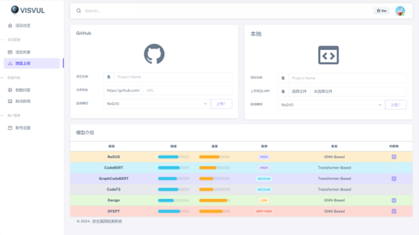

# 代码安全质量检测平台
2024中国计算机设计大赛省部级一等奖，作品展示

## 项目简介
本项目旨在开发一套在静态分析的基础上，利用深度学习模型和可视化手段，提供安全漏洞的自动检索与修复，
同时具有高度的可解释性的漏洞检测系统，实现从开发阶段到运维阶段软件项目全生命周期的漏洞检测。
并优化现有漏洞检测算法，提高漏洞检测效率。为国家信息安全与软件供应链安全保驾护航。

## 技术路线

## 部分页面展示

